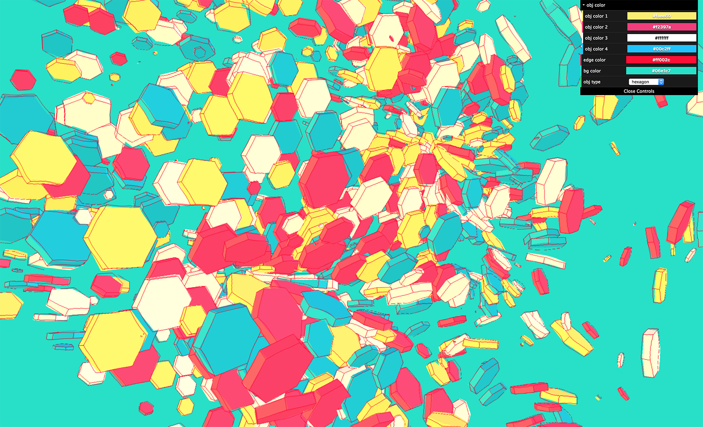
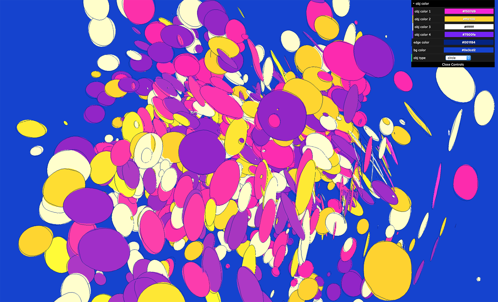
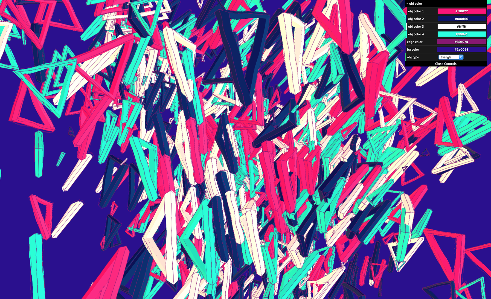
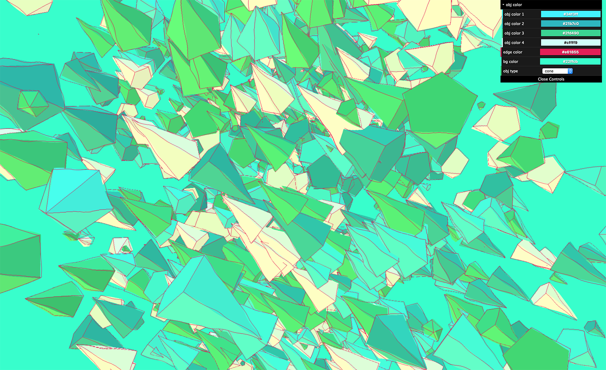

# Rough Drawing Effect
  
* [demo](https://mnmxmx.github.io/rough-drawing-effect/dst/)  
* inspired by [spite - polygon-shredder](https://github.com/spite/polygon-shredder)  
  
[](./screenshot1.png)  
[](./screenshot2.png)  
[](./screenshot3.png)  
[](./screenshot4.png)   
  
## Usage  
* Clone repository  
* Install Node.js  
* Run following commands  
```
  npm install  
  npm start  
```

